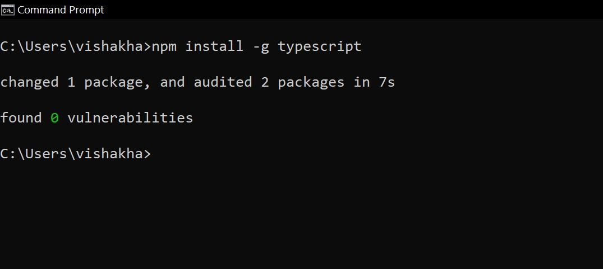
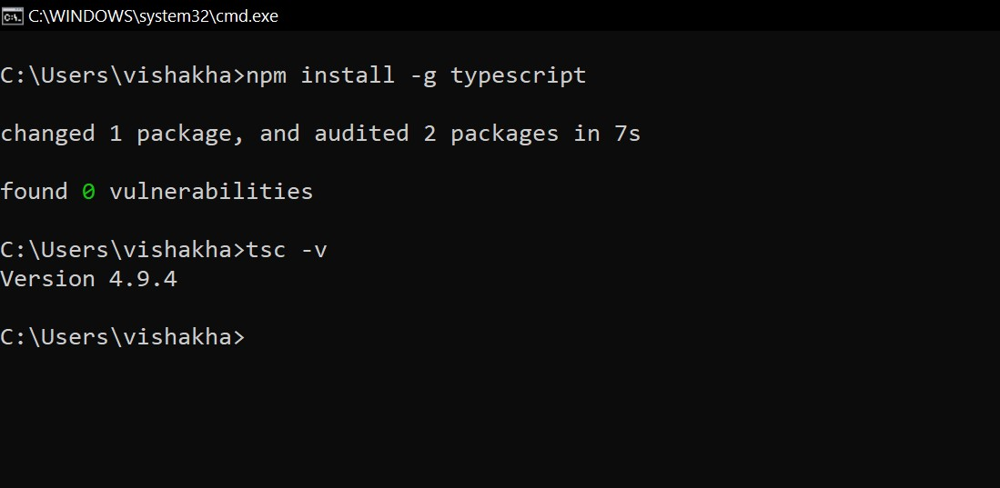

## >> What is TypeScript?

1. TypeScript is a superset of JavaScript.

2. It can be executed anywhere where JavaScript is supported like in the browser.

3. TypeScript provides all the features and functionalities of JavaScript with some added features.

4. TypeScript compiles to JavaScript, which the browser understands.

5. It was created by Microsoft and is open source.

---

## >> Let's understand with basic example.

1. In JavaScript, we can declare a variable of any type without defining it's type
   Like this:

```js
var name = 'John'

var age = 27

var rightAge = true

var fullName = {
    firstName: 'John'
    lastName: 'Doe'
}
```

2. But while using TS, it is necessary to define the type of a variable whether it is a string, number, boolean, etc.

3. Like this:

```ts
let firstName: string = "John";

var myAge: number = 27;
```

4. Now we can't use firstName as a number or boolean, the TypeScript compiler will throw an error

```ts
let firstName: string = false; //error => Type string not assignable to type boolean

var myAge: number = "John"; //error => Type number not assignable to type string
```

5. Now that is why TypeScript saves a lot of time from debugging and helps write consistent code.

6. Moreover, TypeScript provides various other features, like interfaces, type aliases, abstract classes, function overloading, tuple, generics, etc.

---

## >> How to install TypeScript

1. Browsers don’t understand TypeScript.

2. They understand JavaScript code. Hence, the TypeScript code needs to be compiled into JavaScript, and for that, we need the TypeScript compiler.

3. To install TypeScript, we have a command that is

```
npm install -g typescript
```

4. This above command, we have to run it in **command prompt** or **VS code terminal** or **Window powershell** and it will show us this message



5. To check TypeScript version.

```
tsc -v
```



---
