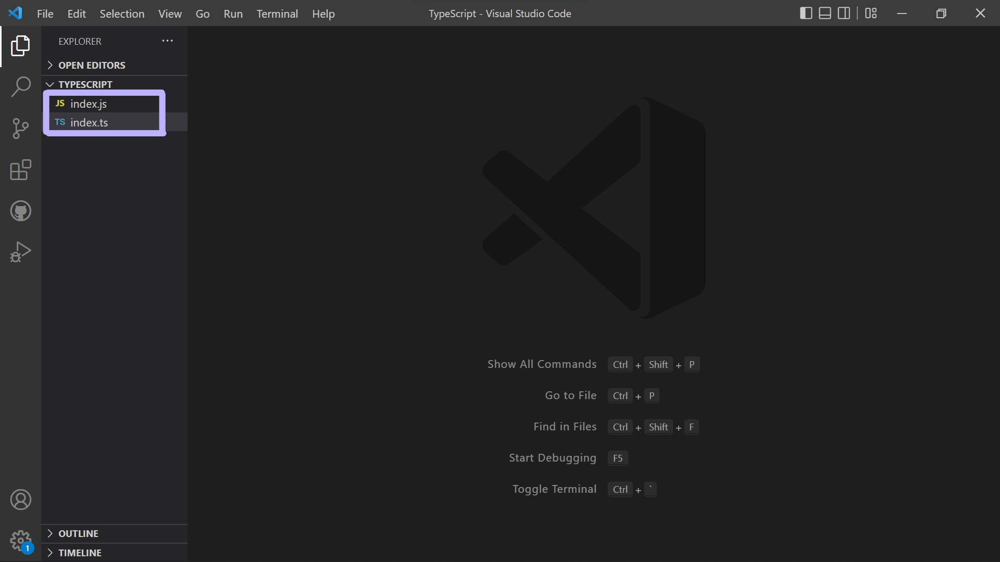
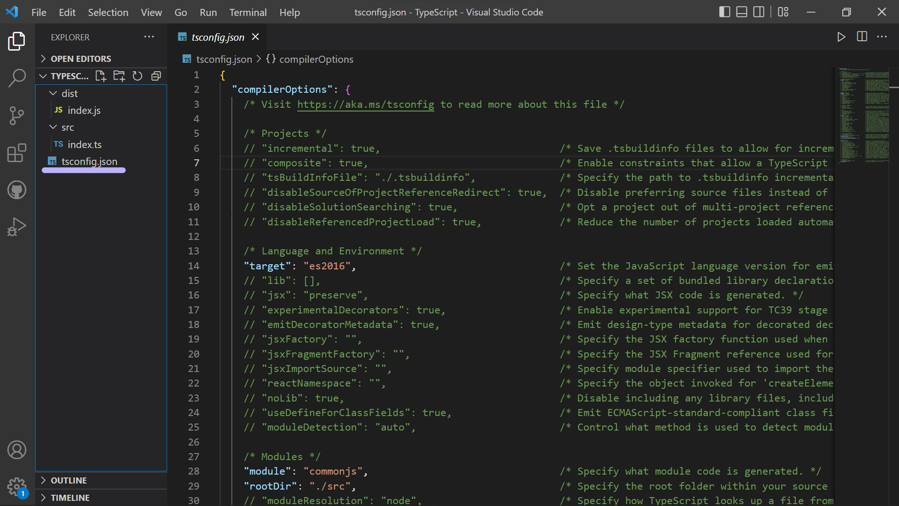
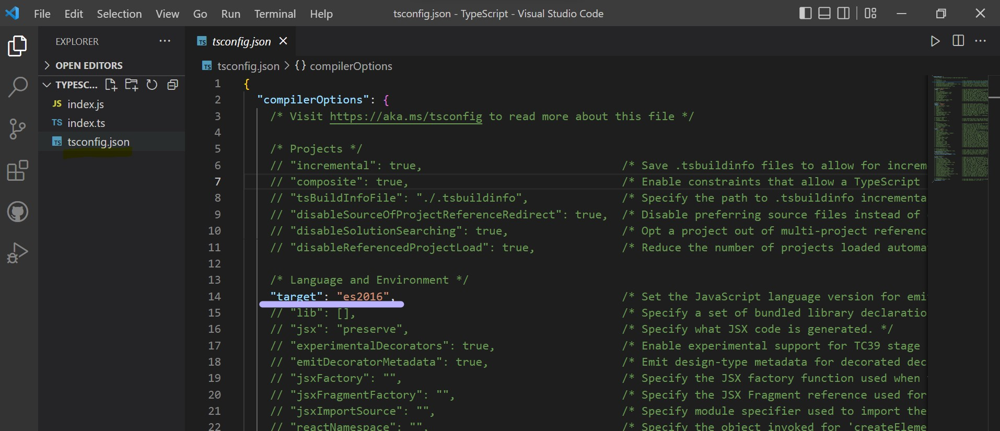
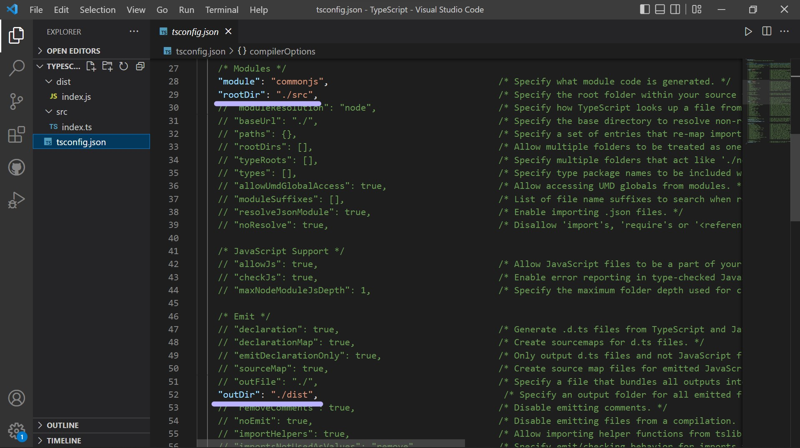
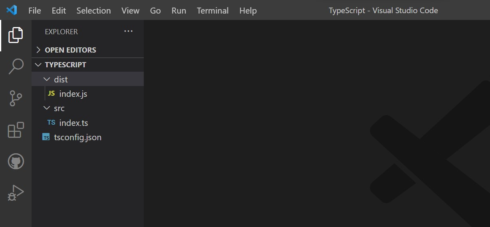

---

## >> How To Compile TypeScript into JavaScript?

1. To compile TypeScript to JavaScript we have a command.

```
>> tsc filename
```

2. This will create a JavaScript file in root directory and all the code that is written in TypeScript file will be compiled to JavaScript.



3. When typing out code in TypeScript we need to check for errors in terminal and we can do it with same command.

```
>> tsc filename
```

4. But we have an alternative too rather than continously typing out **tsc filename** everytime to check for error, we can run another command to continually watch our file for error and that is

```
>> tsc -w filename
```

5. **-w** is a watch flag and will start compliation mode in terminal where we can check for any error without typing **tsc filename** again and again.

---

## >> Configuring TypeScript file

1. To set up a configuration file for TypeScript file we have a command.

```
tsc --init
```

2. This will create a tsconfig.json file in our folder.



3. In this file we can change basic settings for the TypeScript file, like **target** that is the version of JavaScript we are using like es6, es5, and so on.



4. In this we also have **outdir** and **root dir**.

5. We always won't have TypeScript and JavaScript next to each other, for ex: while using react with TypeScript, our TypeScript and JavaScript file will in different folders.

6. Basically we are saying that our TypeScript file will be in **src** folder (rootDir) and JavaScript file in **dist** (outDir) folder. We can change this in the **tsconfig.json** file.

```
"rootDir": "./src"

"outDir": "./dist"
```



7. Now to make it work create two folders named **src** and **dist** and move TypeScript file in **src** folder and JavaScript file in **dist** folder.


